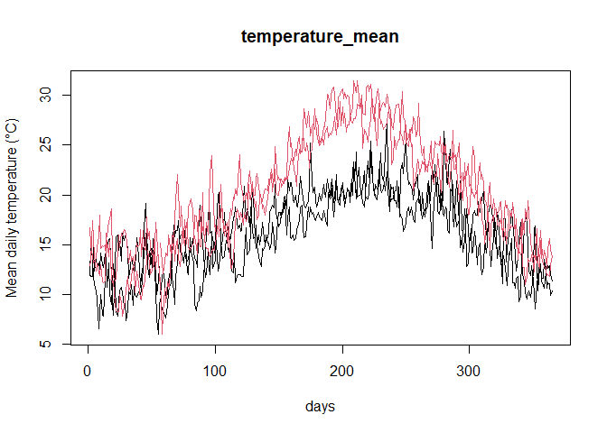

<!-- README.md is generated from README.Rmd. Please edit that file -->

# aemet2fdata: Functional Data from AEMET OpenData

The **aemet2fdata** package downloads daily meteorological data from the
Spanish [AEMET OpenData](https://opendata.aemet.es/) API and converts
them into functional data objects (`fdata`, `ldata`) of the
[**fda.usc**](https://CRAN.R-project.org/package=fda.usc) package, with
**one curve per station and year** (365 days).

## Installation

``` r
# install.packages("remotes")
remotes::install_github("moviedo5/aemet2fdata")
```

## API key

Downloading data requires a personal API key, which can be requested at
<https://opendata.aemet.es/centrodedescargas/altaUsuario>. Keep it out
of your scripts, e.g. in `~/.Renviron`:

    AEMET_API_KEY=your_key

``` r
library(aemet2fdata)
api_key <- Sys.getenv("AEMET_API_KEY")
```

## Main functions

| Function | Result |
|----|----|
| `aemet2inventory()` | stations: `station_id`, `station_name`, `province`, `altitude`, `lon`, `lat`, `wmo_id` |
| `aemet2df()` | daily data as a `data.frame` |
| `aemet2csv()` | whole daily history of each station (half-year requests): one CSV per station |
| `aemet2download()` | resumable bulk download (all stations, many years): one file per station and year |
| `aemet2fdata()` | one variable as `fdata` (station-year x 365 days) |
| `aemet2lfdata()` | several variables as `ldata` (`df` + one `fdata` per variable) |

## Example without API key

The package includes daily data of two stations (1387 A Coruña and B228
Palma Puerto, 2023-2024):

``` r
library(aemet2fdata)
f <- system.file("extdata", "aemet_example.csv", package = "aemet2fdata")

ld <- aemet2lfdata(file = f, vars = c("tmed", "tmax", "tmin", "prec"))
#> Station coordinates (lon, lat) not available: pass 'inventory' (see aemet2inventory()) or 'api_key'.
sapply(ld, NROW)
#>   df tmed tmax tmin prec 
#>    4    4    4    4    4
ld$df
#>           station_id  station_name      province altitude lon lat wmo_id year
#> 1387_2023       1387      A CORUÑA      A CORUÑA       57  NA  NA   <NA> 2023
#> 1387_2024       1387      A CORUÑA      A CORUÑA       57  NA  NA   <NA> 2024
#> B228_2023       B228 PALMA, PUERTO ILLES BALEARS        3  NA  NA   <NA> 2023
#> B228_2024       B228 PALMA, PUERTO ILLES BALEARS        3  NA  NA   <NA> 2024
#>           n_days
#> 1387_2023    365
#> 1387_2024    365
#> B228_2023    365
#> B228_2024    365
```

``` r
plot(ld$tmed, col = as.integer(factor(ld$df$station_id)))
```



## Example with the API

``` r
inv <- aemet2inventory(api_key = api_key, file = "inventory.rds")

ld <- aemet2lfdata(
  station_ids = c("1387", "B228"),
  vars = c("tmed", "tmax", "tmin", "prec"),
  start_date = "2015-01-01",
  end_date = "2024-12-31",
  api_key = api_key,
  inventory = inv,
  output_file = "aemet_ldata.rds"
)
ld$df       # one row per station-year, with lon/lat
plot(ld)
```

## One station, whole history

Two requests per year and station (1 January-30 June, 1 July-31
December); one CSV per station in UTF-8, so station names with accents
or “ñ” are kept. Stations already downloaded are skipped.

``` r
log <- aemet2csv("1387", start_date = "1926-01-01", end_date = "2025-12-31",
                 api_key = api_key, out_dir = "aemet_csv")
ld <- aemet2lfdata(file = "aemet_csv/1387.csv",
                   vars = c("tmed", "tmin", "tmax", "prec", "sol"),
                   inventory = "inventory.rds")
```

## All stations, 1976-2025

``` r
# 1) station metadata (coordinates), once
aemet2inventory(api_key = api_key, file = "inventory.rds")

# 2) all stations with data, one file per station and year
#    (aemet_daily/1387/1387_1976.rds, ...); resumable: if it stops, run it again
log <- aemet2download(
  start_date = "1976-01-01", end_date = "2025-12-31",
  api_key = api_key, out_dir = "aemet_daily",
  vars = c("tmed", "tmin", "tmax", "prec", "sol")
)
table(log$status)

# 3) ldata: one curve per station-year
ld <- aemet2lfdata(file = "aemet_daily", inventory = "inventory.rds")
# or only some stations (reads only their files)
ld2 <- aemet2lfdata(file = "aemet_daily", station_ids = c("1387", "B228"),
                    inventory = "inventory.rds")
ld <- subset(ld, ld$df$n_days >= 360)     # complete years only
saveRDS(ld, "aemet_ldata_1976_2025.rds")
```

## Notes

- Station identifiers are `station_id` (AEMET *indicativo*,
  e.g. `"1387"`), not `wmo_id`.
- One curve per station-year; row names `"station_year"`
  (e.g. `"1387_2023"`) are shared by `ldata$df` and every `fdata`.
- Leap years: February 29 is removed (column 60 is always March 1).
- Missing daily values are kept as `NA`.
- For large downloads, save the data once
  (`aemet2df(..., file = "x.csv")`) and build the functional objects
  from the file; AEMET applies rate limits.

## Related packages

Other R packages access AEMET OpenData with different goals:
[**climaemet**](https://CRAN.R-project.org/package=climaemet) covers
many AEMET services (daily, monthly, normals, extremes, forecasts,
alerts) with tidy and spatial output and climate graphics, and
[**meteospain**](https://CRAN.R-project.org/package=meteospain) gives a
common interface to several Spanish meteorological services.
**aemet2fdata** focuses on long daily series stored locally (one file
per station, or per station and year) and on their conversion into
functional data for **fda.usc**.

Data source: © AEMET. Data use must cite AEMET as the source
(<https://www.aemet.es/es/nota_legal>).

## Citation

``` r
citation("aemet2fdata")
```

## Author

Manuel Oviedo de la Fuente (<manuel.oviedo@udc.es>)

## License

GPL-3

## Acknowledgments

This work was supported by grants from MICINN and the Xunta de Galicia
(ED431C-2020-14, ED431G-2019/01), co-financed by the ERDF.

## References

Febrero-Bande, M. and Oviedo de la Fuente, M. (2012). Statistical
Computing in Functional Data Analysis: The R Package fda.usc. *Journal
of Statistical Software*, 51(4), 1–28.
<https://doi.org/10.18637/jss.v051.i04>

<!--
&#10;getwd()                                   # comprueba dónde estás
#pkg <- "D:/Users/moviedo/OneDrive - Universidade da Coruña/GitHub/AEMET/aemet2fdata"
# unlink(file.path(pkg, c("inst/doc", "doc")), recursive = TRUE)
# devtools::document(pkg)
# remove.packages("aemet2fdata")
&#10;
library(roxygen2)
library(devtools)
# setwd("D:/Users/moviedo/github/fda.usc/")
&#10;#pkgbuild::compile_dll()
#roxygenize()
#unlink(c("inst/doc", "doc"), recursive = TRUE)
devtools::document()
# roxygen2::roxygenise()
&#10;# 1
&#10;tools::checkRd("man/aemet2csv.Rd")
tools::checkRd("man/aemet2df.Rd")
tools::checkRd("man/aemet2fdata.Rd")
tools::checkRd("man/aemet2lfdata.Rd")
tools::checkRd("man/aemet2inventory.Rd")
&#10;devtools::build()
Sys.setenv(TMPDIR = tempdir()) 
devtools::check()
#devtools::check(vignettes = FALSE)
devtools::install()
3
&#10;pkgdown::build_site()
devtools::build_vignettes()
&#10;devtools::build_readme()
&#10;#knitr::knit("README.Rmd")
#knitr::knit("README.Rmd", output = "README.md")
&#10;library(pkgdown)
#pkgdown::clean_site(force = TRUE)
#try(pkgdown::clean_site(force=TRUE), silent=TRUE) #borra figures/
pkgdown::build_site()
&#10;# devtools::build_win()
&#10;
# setwd("..")
# system("R CMD build aemet2fdata")
# system("R CMD check - - as-cran aemet2fdata_0.2.0.tar.gz")
# install.packages("aemet2fdata_0.2.0.tar.gz", repos = NULL, type = "source")
&#10;devtools::install_github("moviedo5/aemet2fdata",auth_user="moviedo5")
R CMD check --as-cran and R-wind-builder 
R CMD build "aemet2fdata
R CMD check aemet2fdata_0.2.0.tar --as-cran  R-wind-builder 
R CMD INSTALL e"aemet2fdata_0.2.0.tar.gz --build
-->
