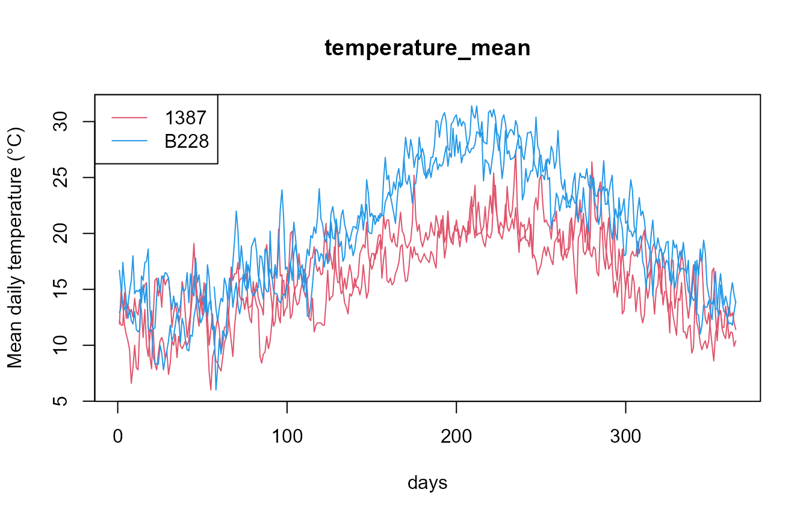
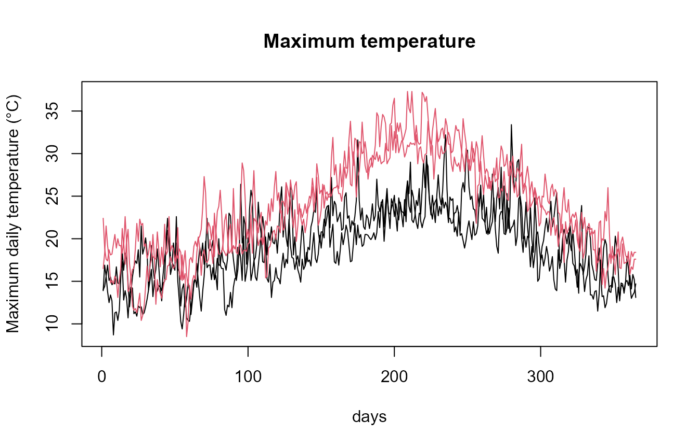
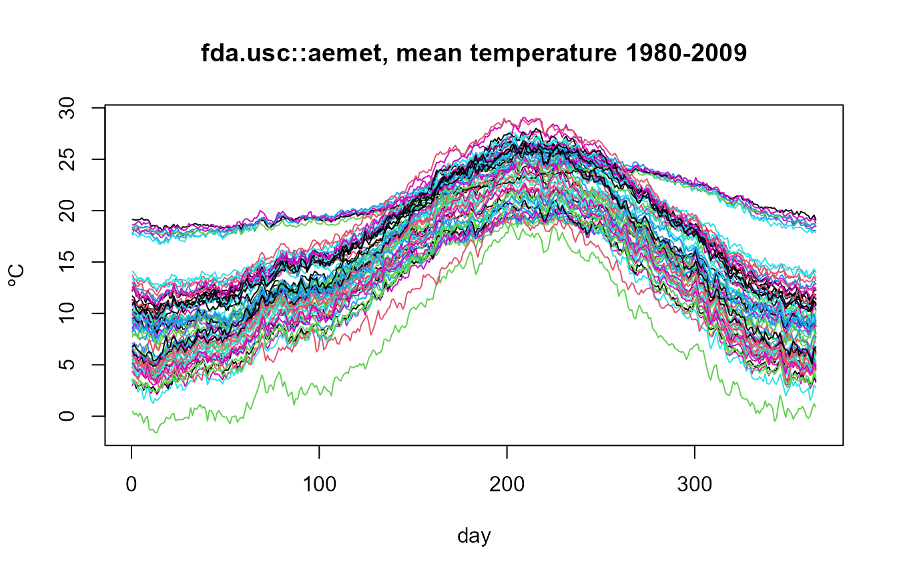

# AEMET OpenData to Functional Data Workflow

## Overview

This vignette illustrates a complete workflow to download daily
meteorological data from **AEMET OpenData** and convert them into
functional data objects of the **fda.usc** package using
**aemet2fdata**.

- AEMET OpenData portal:
  <https://opendata.aemet.es/centrodedescargas/inicio>
- API key request:
  <https://opendata.aemet.es/centrodedescargas/altaUsuario>

Every functional object has **one curve per station and year** with 365
points (`argvals = 1:365`). February 29 is removed, so column 60 is
always March 1. Missing days are kept as `NA`.

## 1. Example without API key

The package ships daily data of two stations (1387, A Coruña, and B228,
Palma Puerto) for 2023-2024. The same code works with a file saved by
`aemet2df(..., file = "mydata.csv")`.

``` r

library(aemet2fdata)
library(fda.usc)
#> Loading required package: fda
#> Loading required package: splines
#> Loading required package: fds
#> Loading required package: rainbow
#> Loading required package: MASS
#> Warning: package 'MASS' was built under R version 4.6.1
#> Loading required package: pcaPP
#> Loading required package: RCurl
#> Warning: package 'RCurl' was built under R version 4.6.1
#> Loading required package: deSolve
#> 
#> Attaching package: 'fda'
#> The following object is masked from 'package:graphics':
#> 
#>     matplot
#> The following object is masked from 'package:datasets':
#> 
#>     gait
#> Loading required package: mgcv
#> Loading required package: nlme
#> Warning: package 'nlme' was built under R version 4.6.1
#> This is mgcv 1.9-4. For overview type '?mgcv'.
#> Loading required package: knitr
#> Warning: package 'knitr' was built under R version 4.6.1
#>  fda.usc is running sequentially usign foreach package
#>  Please, execute ops.fda.usc() once to run in local parallel mode
#>  Deprecated functions: min.basis, min.np, anova.hetero, anova.onefactor, anova.RPm
#>  New functions: optim.basis, optim.np, fanova.hetero, fanova.onefactor, fanova.RPm
#> ----------------------------------------------------------------------------------
f <- system.file("extdata", "aemet_example.csv", package = "aemet2fdata")
```

### One variable: `fdata`

``` r

fd_tmed <- aemet2fdata(file = f, var = "tmed")
dim(fd_tmed)
#> [1]   4 365
rownames(fd_tmed$data)
#> [1] "1387_2023" "1387_2024" "B228_2023" "B228_2024"
```

``` r

plot(fd_tmed, col = rep(c(2, 4), each = 2))
legend("topleft", legend = c("1387", "B228"), col = c(2, 4), lty = 1)
```



The usual **fda.usc** tools apply directly:

``` r

plot(func.mean(fd_tmed), main = "Mean curve", lwd = 2)
```


### Several variables: `ldata`

[`aemet2lfdata()`](https://moviedo5.github.io/aemet2fdata/reference/aemet2lfdata.md)
returns an `ldata` object: `df` has one row per curve (station-year)
with the station metadata, and there is one `fdata` per variable, all
with the same rows.

``` r

ld <- aemet2lfdata(file = f, vars = c("tmed", "tmax", "tmin", "prec"))
#> Station coordinates (lon, lat) not available: pass 'inventory' (see aemet2inventory()) or 'api_key'.
names(ld)
#> [1] "df"   "tmed" "tmax" "tmin" "prec"
sapply(ld, NROW)
#>   df tmed tmax tmin prec 
#>    4    4    4    4    4
ld$df
#>           station_id  station_name      province altitude lon lat wmo_id year
#> 1387_2023       1387      A CORUÑA      A CORUÑA       57  NA  NA   <NA> 2023
#> 1387_2024       1387      A CORUÑA      A CORUÑA       57  NA  NA   <NA> 2024
#> B228_2023       B228 PALMA, PUERTO ILLES BALEARS        3  NA  NA   <NA> 2023
#> B228_2024       B228 PALMA, PUERTO ILLES BALEARS        3  NA  NA   <NA> 2024
#>           n_days
#> 1387_2023    365
#> 1387_2024    365
#> B228_2023    365
#> B228_2024    365
is.ldata(ld)
#> [1] TRUE
```

Subsets and plots use the `ldata` methods of **fda.usc**:

``` r

ld_coruna <- subset(ld, ld$df$station_id == "1387")
sapply(ld_coruna, NROW)
#>   df tmed tmax tmin prec 
#>    2    2    2    2    2
```

``` r

plot(ld$tmax, col = as.integer(factor(ld$df$station_id)),
     main = "Maximum temperature")
```



## 2. Downloading from the API

``` r

api_key <- Sys.getenv("AEMET_API_KEY")
```

### Station inventory

[`aemet2inventory()`](https://moviedo5.github.io/aemet2fdata/reference/aemet2inventory.md)
returns one row per station with `station_id`, `station_name`,
`province`, `altitude` (m), `lon`, `lat` (decimal degrees) and `wmo_id`.
Save it once and reuse it: the daily data do not include coordinates, so
the inventory is what provides `lon` and `lat` in `ldata$df`.

``` r

inv <- aemet2inventory(api_key = api_key, file = "inventory.rds")
head(inv)
```

### Daily data

``` r

df <- aemet2df(
  station_ids = c("1387", "B228"),
  start_date = "2018-01-01",
  end_date = "2020-12-31",
  vars = c("tmed", "prec", "tmin", "tmax"),
  api_key = api_key,
  file = "mydata.csv"
)
head(df)
```

### Functional objects

``` r

ld <- aemet2lfdata(file = "mydata.csv", inventory = "inventory.rds")
ld$df
plot(ld)

# or directly from the API
ld <- aemet2lfdata(
  station_ids = c("1387", "B228"),
  vars = c("tmed", "prec"),
  start_date = "2018-01-01",
  end_date = "2020-12-31",
  api_key = api_key,
  inventory = inv
)
```

### One station, whole history: `aemet2csv()`

[`aemet2csv()`](https://moviedo5.github.io/aemet2fdata/reference/aemet2csv.md)
requests each station in half-year windows (1 January-30 June and 1
July-31 December, i.e. two requests per year), from the most recent
backwards, and writes **one CSV per station** with its whole daily
history. The CSV is written in UTF-8 whatever the locale, so station
names with accents or “ñ” are kept. Stations already downloaded are
skipped, so an interrupted run is resumed by running the same call
again.

``` r

log <- aemet2csv(c("1387"), start_date = "2006-01-01",
                 end_date = "2025-12-31", api_key = api_key,
                 out_dir = "aemet_csv")
log

ld <- aemet2lfdata(file = "aemet_csv/1387.csv",
                   vars = c("tmed", "tmin", "tmax", "prec", "sol"),
                   inventory = "inventory.rds")
ld <- subset(ld, ld$df$n_days >= 365)          # complete years
plot(ld$tmed, col = hcl.colors(nrow(ld$df), "Blue-Red 3"))
```

### All stations over long periods

For many stations and years use
[`aemet2download()`](https://moviedo5.github.io/aemet2fdata/reference/aemet2download.md):
it requests all stations at once (AEMET `todasestaciones` service) in
short windows and, when a year is complete, saves **one file per station
and year** (`aemet_daily/1387/1387_1976.rds`, …). It is resumable: run
the same call again to continue or to retry failed windows. Then pass
the directory to
[`aemet2lfdata()`](https://moviedo5.github.io/aemet2fdata/reference/aemet2lfdata.md)
(optionally with `station_ids` to read only some stations).

``` r

log <- aemet2download(
  start_date = "2006-01-01",
  end_date   = "2025-12-31",
  api_key    = api_key,
  out_dir    = "aemet_daily",
  vars       = c("tmed", "tmin", "tmax", "prec", "sol")
)
table(log$status)

ld <- aemet2lfdata(file = "aemet_daily", inventory = "inventory.rds")
table(ld$df$year)

# complete years (>= 360 days) of stations with the 50 years
ld  <- subset(ld, ld$df$n_days >= 360)
ny  <- table(ld$df$station_id)
ld50 <- subset(ld, ld$df$station_id %in% names(ny)[ny == 50])
```

Station identifiers are `station_id` (AEMET *indicativo*,
e.g. `"1387"`), not `wmo_id`.

## 3. Built-in dataset from fda.usc

**fda.usc** includes the dataset `aemet` (73 stations, averages
1980-2009):

``` r

data(aemet)
names(aemet)
#> [1] "df"         "temp"       "wind.speed" "logprec"
plot(aemet$temp, main = "fda.usc::aemet, mean temperature 1980-2009")
```



It is a **climatological** (averaged) version, with one curve per
station, whereas **aemet2fdata** gives one curve per station and year.

## 4. Recommended workflow for large downloads

1.  Download the inventory once:
    `aemet2inventory(api_key, file = "inventory.rds")`.
2.  Download data once:
    [`aemet2csv()`](https://moviedo5.github.io/aemet2fdata/reference/aemet2csv.md)
    (some stations, whole history),
    [`aemet2download()`](https://moviedo5.github.io/aemet2fdata/reference/aemet2download.md)
    (all stations) or `aemet2df(..., file = "mydata.csv")`.
3.  Build functional objects from the files:
    `aemet2lfdata(file = "mydata.csv", inventory = "inventory.rds")`.

This avoids repeated API calls and respects the AEMET OpenData service.

## Related packages

**climaemet** and **meteospain** also access AEMET OpenData: the first
covers many AEMET services with tidy/spatial output and climate
graphics, the second several Spanish meteorological services with a
common format. **aemet2fdata** focuses on long daily series stored
locally and on their conversion into functional data for **fda.usc**.
Data source: © AEMET.
